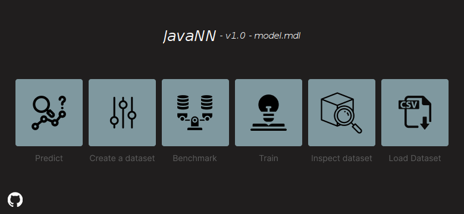
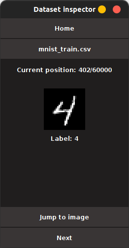

I need to build a project for school in Java, and I challenged myself to building a Neural Network from scratch. 
This led to the development of a nn engine, which I plan on expanding [here](https://github.com/c4vxl/jNN) in the future

---

    

## About
### The Engine:
The core engine introduces a new data type called Tensor, which can be thought of as a multidimensional matrix supporting various data types. It is capable of performing a wide range of mathematical operations, including element-wise computation, matrix multiplication, reshaping, transposing, and more.

##### Core components:
`Module Class`:
The Module class serves as a base for any model or layer that requires serialization or saving.

`Linear Class`:
The Linear class implements linear transformation by performing weight multiplication and adding an optional bias which can booth be learned during training.

### The goal:
The goal of this project was to create a neural network, capable of identifying any kind of handwritten digit on an 28*28 pixel canvas.

---

## Technical details
##### The model consists of:
- 784 inputs (for 28*28 pixels)
- 10 outputs (Numbers from 0-9)
- 2 hidden layers
- 12 neurons per hidden layer

This adds up to a total of `818 neurons` in the entire model.

##### Dataset:
It has been trained on the train split of the [MNIST Dataset](https://yann.lecun.com/exdb/mnist/) (600000 images) 

---

## User App

### Predict
The user can draw a digit on a canvas, and the AI will attempt to predict the digit in real-time.

  
<strong>Image</strong>

### Create Dataset
This feature enables users to create a personalized dataset by drawing digits multiple times.
The generated dataset can be used to fine-tune the model, helping it adapt to the user's handwriting style for improved accuracy.

  
<strong>Image</strong>

### Benchmark
The benchmarking tool allows users to evaluate the model's performance on any dataset of their choice.

  
<strong>Image</strong>

### Train
Here, users can train their own model using custom parameters. The following training parameters can be configured:

- Shuffle Batches: `Randomizes the order of training samples to improve generalization.`
- Number of Epochs: `Defines how many times the entire dataset is used for training.`
- Logging Rate: `Determines how often the training progress is logged.`
- Validation Rate: `Specifies how often to validate the model's performance on the validation split.`
- Learning Rate: `Controls how much to adjust the model’s weights during each update.`
- Weight Decay: `Regularizes the model by penalizing large weights, helping to prevent overfitting.`
- Loss Function: `Switch between meanSquareLoss or crossEntropyLoss`

  
<strong>Image</strong>

## Training Menu

## Configuration of training

### Inspect Dataset
This feature lets users load and explore any dataset. Each image is displayed alongside its corresponding label.

  
<strong>Image</strong>

### Downloader
Users can directly download datasets from Hugging Face through this feature. It provides options to browse available datasets or search for a specific one.

  
<strong>Image</strong>

# Licence
It's mine, don't copy!
